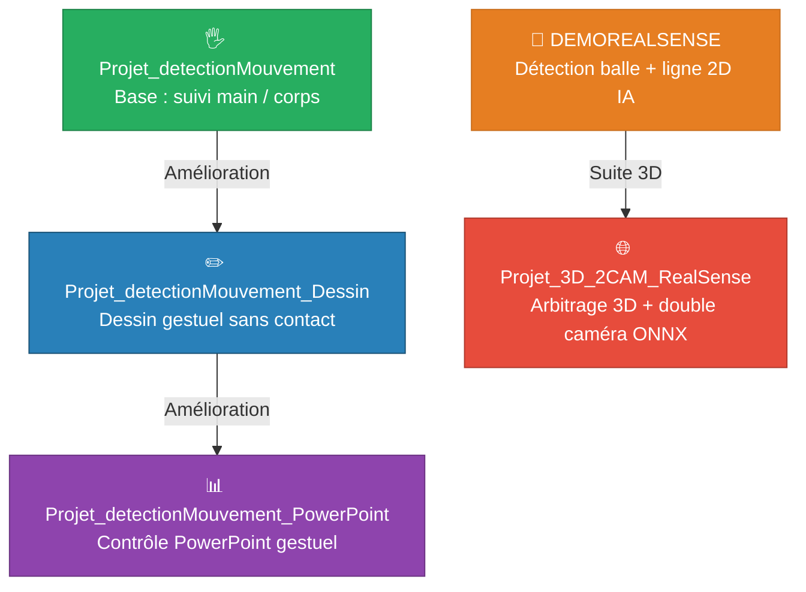

# 📷 Projet Intégration — Caméra Intel RealSense D455

> Détection gestuelle · Dessin sans contact · Contrôle PowerPoint · Arbitrage IA Pickleball 2D/3D

**Python 3.11.9** · **C# WPF / WinForms** · **Intel RealSense D455** · **OpenCV** · **MediaPipe** · **YOLO ONNX / OpenVINO**

---

## 📋 Table des matières

- [🗺️ Vue d'ensemble](#%EF%B8%8F-vue-densemble-de-la-progression)
- [🛠️ Matériel requis](#%EF%B8%8F-matériel-requis)
- [⚙️ Prérequis communs](#%EF%B8%8F-prérequis-communs)
- [🟢 Détection de mouvement](#-projet_detectionmouvement--détection-de-mouvement-base)
- [🔵 Dessin gestuel](#-projet_detectionmouvement_dessin--dessin-gestuel)
- [🟣 Contrôle PowerPoint gestuel](#-projet_detectionmouvement_powerpoint--contrôle-powerpoint-gestuel)
- [🟠 Détection balle & ligne 2D (IA)](#-demorealsense--détection-balle--ligne-2d-ia)
- [🔴 Détection 3D double caméra (IA ONNX)](#-projet_3d_2cam_realsense--détection-3d-double-caméra-ia-onnx)
- [📐 Guide de calibration](#-guide-de-calibration)
- [📦 Structure du dépôt](#-structure-du-dépôt)
- [🧰 Stack technique](#-stack-technique)

---

## 🗺️ Vue d'ensemble de la progression

Ce projet regroupe **5 applications** développées progressivement en deux séries indépendantes, utilisant la caméra Intel RealSense D455 comme interface commune.



| Série | Projets | Description |
|:------|:--------|:------------|
| 🤚 **Série gestuelle** | `detectionMouvement` → `Dessin` → `PowerPoint` | Progression linéaire : chaque projet étend le précédent |
| 🏓 **Série pickleball** | `DEMOREALSENSE` → `Projet_3D_2CAM_RealSense` | Du jugement 2D à l'arbitrage temps réel en 3D |

---

## 🛠️ Matériel requis

| Projet | Caméras | Accessoires |
|:-------|:-------:|:------------|
| 🟢 Projet_detectionMouvement | 1× D455 | — |
| 🔵 Projet_detectionMouvement_Dessin | 1× D455 | — |
| 🟣 Projet_detectionMouvement_PowerPoint | 1× D455 | Fichier `.pptx` |
| 🟠 DEMOREALSENSE | 1× D455 | Ruban adhésif + balle pickleball jaune |
| 🔴 Projet_3D_2CAM_RealSense | **2×** D455 | Ruban adhésif + balle pickleball jaune |

> ⚠️ **Important :** Toutes les caméras RealSense D455 doivent être branchées sur un **port USB 3.0 (entrée bleue)**. Les ports USB 2.0 (noirs) ne supportent pas le débit requis.

---

## ⚙️ Prérequis communs

| Outil | Version | Utilisation |
|:------|:-------:|:------------|
| Python | `3.11.9` Windows 64-bit | Tous les projets Python |
| Visual Studio | Avec support .NET / WPF | Applications C# |
| Intel RealSense SDK 2.0 | Dernière version | Pilotes + librealsense |
| USB 3.0 | Port bleu obligatoire | Connexion des caméras |

### Installation des dépendances Python

Chaque sous-projet contient son propre `requirements.txt`. Procédure commune :

```bash
# Depuis le dossier PythonDetection du projet concerné
python -m venv venv
.\venv\Scripts\activate
pip install -r requirements.txt
```

---

## 🟢 Projet_detectionMouvement — Détection de mouvement (base)

> **Sprint 1 — Story 3**
> *En tant que développeur, je souhaite détecter les mouvements humains (mains/corps) afin de les suivre dans le champ de vision.*

### 📖 Description

Premier projet de la série gestuelle. Il établit la chaîne **Python ↔ C# via socket TCP** : Python détecte les mains et le corps en temps réel avec MediaPipe, puis envoie les coordonnées à l'application WPF C# qui les affiche graphiquement.

### 🏗️ Architecture

```
Projet_detectionMouvement/
├── PythonDetection/
│   ├── main.py                 ← Point d'entrée Python
│   ├── hand_detector.py        ← Détection MediaPipe (mains + corps)
│   ├── socket_server.py        ← Serveur TCP → envoi données vers C#
│   └── requirements.txt
└── Projet_detectionMouvement/  (app WPF C#)
    ├── Service/
    │   ├── RealSenseService.cs ← Flux caméra
    │   ├── SocketClient.cs     ← Réception données Python
    │   └── TrackingService.cs  ← Logique de suivi
    └── ViewModels/MainViewModel.cs
```

### 🚀 Lancement

```bash
# Terminal 1 — Python
cd Projet_detectionMouvement/PythonDetection
.\venv\Scripts\activate
python main.py

# Terminal 2 / Visual Studio — C#
# Ouvrir Projet_detectionMouvement.sln et lancer
```

### ✅ Fonctionnalités

- Détection des **mains et du corps** via la caméra RealSense D455
- Rendu du **squelette et des points** en temps réel dans l'interface WPF C#
- Communication bas-latence par **socket TCP**

---

## 🔵 Projet_detectionMouvement_Dessin — Dessin gestuel

> **Sprint 1 — Story 4**
> *En tant qu'utilisateur, je souhaite dessiner avec les doigts depuis la caméra sans rien toucher afin d'écrire un message ou faire un dessin.*

### 📖 Description

Évolution directe de `Projet_detectionMouvement`. Ajoute un **système de dessin complet** piloté uniquement par les gestes des mains, avec flux vidéo en direct et palette d'outils complète (crayon, pinceau, marqueur, gomme).

### ➕ Nouveautés par rapport à la base

| Fichier | Rôle |
|:--------|:-----|
| `video_server.py` | Flux vidéo en direct (Python → C#) |
| `VideoClient.cs` | Réception et affichage du flux vidéo en C# |
| `Icons/` | Icônes outils : crayon, pinceau, marqueur, gomme, effacer |

### 🚀 Lancement

```bash
cd Projet_detectionMouvement_Dessin/PythonDetection
.\venv\Scripts\activate
python main.py
# Puis lancer le .sln dans Visual Studio
```

### 🖐️ Gestes et contrôles

| Geste | Action |
|:------|:-------|
| ☝️ Index seul | Dessiner |
| ✌️ Index + majeur | Sélectionner un outil (couleur, pinceau, gomme…) |
| ✊ Poing fermé 3s sur le dessin | Sélectionner et déplacer le dessin |
| 🖐️ Main complète ouverte | Désélectionner / arrêter de dessiner |
| 🙌 Deux mains ouvertes pendant 5s | Enregistrer le dessin sur le bureau |

> 💡 **Astuce :** après un tracé, dépliez tous les doigts pour vous déplacer sans dessiner accidentellement.

---

## 🟣 Projet_detectionMouvement_PowerPoint — Contrôle PowerPoint gestuel

> **Sprint 1 — Story 5**
> *En tant qu'utilisateur, je souhaite faire une présentation PowerPoint en 3D afin de pouvoir manipuler le PowerPoint avec la main.*

### 📖 Description

Évolution finale de la série gestuelle. Construit sur `Projet_detectionMouvement_Dessin`, il ajoute un **service PowerPoint** et un **reconnaisseur de gestes avancé** permettant de contrôler entièrement une présentation sans souris ni clavier, par simple geste de la main.

### ➕ Nouveautés par rapport à Dessin

| Fichier | Rôle |
|:--------|:-----|
| `GestureRecognizer.cs` | Classification et interprétation des gestes complexes |
| `PowerPointService.cs` | Intégration COM avec Microsoft PowerPoint |

### 🚀 Lancement

```bash
cd Projet_detectionMouvement_PowerPoint/PythonDetection
.\venv\Scripts\activate
python main.py
# Puis lancer le .sln dans Visual Studio
# Dans l'application : cliquer "Ouvrir PowerPoint" → sélectionner votre fichier .pptx
```

### 🖐️ Gestes et contrôles

| Geste | Action |
|:------|:-------|
| 🤚 Main gauche ouverte + balayage ←/→ | Changer de slide |
| 🖐️ Main droite ouverte pendant 5s | Sélectionner la présentation |
| 🤏 Index + pouce écartés (main droite, sélectionné) | Zoom avant |
| 🤏 Index + pouce rapprochés (main droite, sélectionné) | Zoom arrière |
| ☝️ Index seul (main droite, sélectionné) | Déplacer la présentation |
| 🤟 Trois derniers doigts dépliés (main droite) | Figer la présentation |
| 🙌 Deux mains ouvertes pendant 1,5s | Fermer la présentation |

> 💡 **Astuce :** pour enchaîner les slides, refermez la main entre chaque balayage pour éviter les allers-retours involontaires.

---

## 🟠 DEMOREALSENSE — Détection balle & ligne 2D (IA)

> **Sprint 1 — Stories 1 & 2**
> *(1) Détecter la ligne et la balle automatiquement avec l'IA pour déterminer si la balle est IN ou OUT*
> *(2) Afficher un message indiquant si la balle est IN ou OUT*

### 📖 Description

Premier projet de la série pickleball. Application **C# WinForms** (tout-en-un, sans composant Python séparé) qui détecte la balle et la ligne de jeu avec deux approches : un mode algorithmique configurable et un mode IA utilisant **YOLO exporté en OpenVINO**. Inclut un mécanisme de **capture photo** pour constituer des jeux de données d'entraînement.

### 🏗️ Architecture

```
DEMOREALSENSE/
└── DEMOREALSENSE/
    ├── Models/
    │   ├── ball_openvino/       ← Modèle YOLO balle (format OpenVINO .xml)
    │   └── line_openvino/       ← Modèle YOLO ligne (format OpenVINO .xml)
    ├── BallDetector.cs          ← Détection et suivi de la balle
    ├── ClickLineDetector.cs     ← Tracé de ligne manuel (mode algorithmique)
    ├── YoloDetectionStrategy.cs ← Stratégie IA (OpenVINO)
    ├── IDetectionStrategy.cs    ← Interface stratégie de détection
    ├── ImpactDetector.cs        ← Détection de rebond
    ├── InOutJudge.cs            ← Moteur de jugement IN/OUT
    ├── OverlayRenderer.cs       ← Affichage overlay en temps réel
    └── RealSenseCameraService.cs
```

### 🚀 Lancement

```bash
# 1. Brancher la caméra RealSense D455 sur un port USB 3
# 2. Placer la ligne de jeu et la balle dans le champ de vision
# 3. Positionner la caméra perpendiculairement à la ligne
# 4. Ouvrir DEMOREALSENSE.sln dans Visual Studio et lancer
```

### 🎮 Mode Algorithmique — Contrôles

| Raccourci | Action |
|:----------|:-------|
| `A` | Activer / désactiver la détection automatique de balle |
| `SHIFT + CLIC` sur la balle | Recalibrer la couleur de détection |
| `CLIC` sur la balle | Identifier manuellement la balle |
| `CTRL + CLIC` (×6 min) sur la ligne | Tracer la ligne de jeu |
| `F` | Inverser le côté IN/OUT |
| `R` | Supprimer la ligne tracée |

### 🤖 Mode IA — Contrôles

| Raccourci / Bouton | Action |
|:-------------------|:-------|
| Bouton bas-droite ou touche `M` | Basculer en mode IA (YOLO/OpenVINO) |
| Détection automatique | Balle + ligne détectées par les modèles entraînés |

### 📊 Indicateurs affichés

| Indicateur | Description |
|:-----------|:------------|
| 🟢 **IN** / 🔴 **OUT** | Jugement en bas à gauche — OUT affiché pendant 5s |
| **FPS** | Latence de la détection en temps réel |
| **Distance** | Distance réelle de la balle (mètres) |
| **Rebond** | Marque visuelle au point d'impact au sol |
| 📷 **Bouton photo** | Capture dans `Bureau/RealSense_Captures/` pour l'entraînement IA |

---

## 🔴 Projet_3D_2CAM_RealSense — Détection 3D double caméra (IA ONNX)

> **Sprint 2 — Stories 1, 2 & 3**
> *(1) Matérialiser un terrain réel en 3D à partir de la caméra*
> *(2) Voir les mouvements de la balle sur le terrain 3D*
> *(3) Utiliser une deuxième caméra pour détecter la hauteur et les rebonds*

### 📖 Description

Suite directe de DEMOREALSENSE, passant à une architecture **double caméra** et une représentation **3D temps réel** du terrain. La détection de balle est améliorée avec un modèle **YOLO entraîné et exporté en ONNX**, couplé à un filtrage HSV, pour une robustesse accrue. Un **moteur géométrique** (`geometry_engine.py`) corrige la parallaxe et triangule la position réelle de la balle dans l'espace 3D.

### 📈 Améliorations clés vs DEMOREALSENSE

| Aspect | 🟠 DEMOREALSENSE | 🔴 Projet_3D_2CAM_RealSense |
|:-------|:--------------:|:---------------------------:|
| Caméras | 1 | **2** (TOP + SIDE) |
| Vue | 2D | **3D** temps réel |
| Modèle IA | YOLO OpenVINO | YOLO **ONNX** entraîné |
| Rebond | Estimation 2D | Détection position 3D exacte |
| Interface | WinForms | **WPF 3D** (HelixToolkit) |
| Communication | N/A | Socket TCP Python → C# |

### 📷 Placement recommandé des caméras

```
        ┌──────────────────────────┐
        │  📷 Caméra TOP (dessus)  │  ← Vue d'ensemble : jugement IN/OUT + position XY
        │                          │
        │      terrain de jeu      │
        │    (lignes en ruban)     │
        │                          │
        └──────────────────────────┘
              ↑
        📷 Caméra SIDE (côté)       ← Vue profil : hauteur Z + détection des rebonds
```

| Caméra | Rôle |
|:-------|:-----|
| **TOP cam** (vue dessus) | Vue d'ensemble, juge final IN/OUT, position XY de la balle |
| **SIDE cam** (vue de côté) | Mesure de la hauteur Z (mètres), détection des rebonds |

### 🏗️ Architecture système

```
[TOP cam RealSense D455]          [SIDE cam RealSense D455]
         ↓                                   ↓
  ball_detector.py               side_height_tracker.py
  (YOLO ONNX + HSV + EMA)        (hauteur en mètres)
         ↓                                   ↓
              geometry_engine.py
         (plan 3D, correction parallaxe, triangulation)
                        ↓
              bounce_detector.py
                        ↓
               socket_server.py
             (JSON via TCP :5000)
                        ↓
          [C# WPF Application]
    SocketClient → MainViewModel → MainWindow (HelixToolkit 3D)
```

### 🏗️ Structure des fichiers

```
Projet_3D_2CAM_RealSense/
├── PythonDetection/
│   ├── main.py                  ← Point d'entrée principal (dual-cam + socket)
│   ├── ball_detector.py         ← Détection hybride YOLO ONNX + HSV
│   ├── yolo_ball_detector.py    ← Inférence ONNX YOLOv8
│   ├── bounce_detector.py       ← Détection de rebond par analyse cinématique
│   ├── geometry_engine.py       ← Calculs 3D, plan du sol, correction parallaxe
│   ├── side_height_tracker.py   ← Mesure de hauteur (SIDE cam)
│   ├── terrain_calibrator.py    ← Outil de calibration du terrain (TOP cam)
│   ├── socket_server.py         ← Serveur TCP → envoi JSON vers C#
│   ├── terrain_corners.json     ← Calibration TOP cam (généré)
│   ├── side_terrain_calib.json  ← Calibration SIDE cam (généré)
│   ├── floor_calib.json         ← Seuil sol/air (généré)
│   ├── ball_detect.onnx         ← Modèle YOLO entraîné (requis)
│   └── requirements.txt
└── WPF_App/
    ├── MainWindow.xaml / .cs    ← Interface 3D HelixToolkit
    ├── MainViewModel.cs         ← Logique de réception socket
    ├── SocketClient.cs          ← Client TCP C#
    └── BallData.cs              ← Modèle de données reçu de Python
```

### 🖥️ Résultats attendus dans l'interface 3D

| Élément | Description |
|:--------|:------------|
| Terrain 3D | Rendu en temps réel avec le nom du match |
| 🟡 Balle jaune | Balle détectée au sol |
| 🔵 Balle bleue | Balle en vol (hauteur > seuil) |
| 🔴 Balle rouge + verdict | Balle OUT |
| Anneau d'impact | Position exacte du rebond sur le terrain 3D |
| 🟢 IN / 🔴 OUT | Arbitrage en temps réel selon la TOP cam |

### ⚠️ Limitations connues

- **FPS insuffisants** pour les rebonds très rapides — limitation matérielle de la fréquence d'acquisition
- **Sensibilité à l'éclairage** — éclairage homogène requis, éviter les objets jaunes et ronds dans le champ
- **USB 3.0 obligatoire** — les deux caméras simultanées requièrent un port USB 3 chacune

---

## 📐 Guide de calibration

> ⚠️ **Étape obligatoire avant toute utilisation de `Projet_3D_2CAM_RealSense`.** À répéter à chaque déplacement de caméra ou changement de position du terrain.

La calibration traduit les coordonnées **pixels** des caméras en **coordonnées 3D réelles (mètres)**, permettant au système de savoir précisément où se trouve le terrain et de juger IN/OUT avec précision.

### Calibration 1 — Terrain TOP cam (`terrain_calibrator.py`)

Définit le polygone IN/OUT, modélise le plan du sol, et calcule la taille attendue de la balle à chaque position du terrain.

```bash
cd Projet_3D_2CAM_RealSense/PythonDetection
.\venv\Scripts\activate
python terrain_calibrator.py
```

**Ordre de clic obligatoire :**

```
1 ────── 2
│        │
│        │
4 ────── 3
```

| Ordre | Coin |
|:-----:|:-----|
| 1 | Haut-Gauche |
| 2 | Haut-Droite |
| 3 | Bas-Droite |
| 4 | Bas-Gauche |

| Touche | Action |
|:------:|:-------|
| `R` | Réinitialiser les points |
| `Q` | Quitter et sauvegarder |

> ⚠️ Un clic dans le mauvais ordre inverse le terrain — les jugements IN/OUT seront incorrects.

**Fichier généré :** `terrain_corners.json`

```json
{
  "corners": [{"x": ..., "y": ..., "z": ...}, ...],
  "pixels":  [[x, y], ...]
}
```

---

### Calibration 2 — Terrain SIDE cam (touche `C` au lancement)

Définit le trapèze de référence (terrain vu en perspective) pour normaliser la mesure de hauteur de la balle.

Se réalise lors du lancement de `test_dual_cam_bounce.py` ou `main.py` :

1. La fenêtre SIDE cam s'ouvre
2. Si le terrain rouge n'est pas bien positionné → appuyer sur **`C`**
3. Cliquer les 4 coins dans le **même ordre** qu'avec la TOP cam
4. Appuyer sur **`ESPACE`** avec la balle posée au sol pour calibrer la position du sol

**Fichier généré :** `side_terrain_calib.json`

---

### Calibration 3 — Hauteur zéro TOP cam (touche `T`)

Fixe le point de référence « balle au sol » pour corriger les légères erreurs de hauteur de la TOP cam.

1. Placer la balle sur le **viseur affiché** dans la fenêtre TOP cam
2. Appuyer sur **`T`**

**Fichier généré :** `floor_calib.json`

```json
{
  "floor_h": 0.3937,
  "ground_thresh": 0.4507
}
```

---

### Correction de parallaxe

Quand la balle est en l'air, la TOP cam (en angle) perçoit la balle décalée par rapport à sa vraie position au sol. Le `geometry_engine.py` corrige automatiquement cet effet pour chaque frame :

```
📷 TOP cam (en angle)
 \
  \ ← rayon visuel
   \
    🔵 balle en l'air (position apparente dans l'image)
      \
       × ← vraie position projetée sur le sol (décalée !)
         terrain
```

Le moteur calcule la position 3D réelle de la balle via triangulation (rayon + plan du sol), puis projette cette position directement au sol — c'est cette position corrigée (`court_u_geo`, `court_v_geo`) qui est utilisée pour le jugement IN/OUT.

---

### Récapitulatif des fichiers de calibration

| Fichier | Généré par | Contenu | Obligatoire |
|:--------|:----------|:--------|:-----------:|
| `terrain_corners.json` | `terrain_calibrator.py` | Coins 3D + pixels du terrain (TOP) | ✅ |
| `side_terrain_calib.json` | Touche `C` au lancement | Coins du terrain (SIDE) | ✅ |
| `floor_calib.json` | Touche `ESPACE` + `T` | Seuil sol/air | ✅ |

---

## 📦 Structure du dépôt

```
PROJET_INTEGRATION_CAMERA_REALSENSE_D455/
├── Projet_detectionMouvement/            ← 🟢 Base gestuelle (Sprint 1 — S3)
├── Projet_detectionMouvement_Dessin/     ← 🔵 Dessin gestuel (Sprint 1 — S4)
├── Projet_detectionMouvement_PowerPoint/ ← 🟣 PowerPoint gestuel (Sprint 1 — S5)
├── DEMOREALSENSE/                        ← 🟠 Balle + ligne 2D IA (Sprint 1 — S1/S2)
└── Projet_3D_2CAM_RealSense/            ← 🔴 3D dual-cam ONNX (Sprint 2 — S1/S2/S3)
```

---

## 🧰 Stack technique

| Composant | Technologie |
|:----------|:-----------|
| 📷 Caméra | Intel RealSense D455 (×1 ou ×2) |
| 🖥️ Applications UI | C# WPF / WinForms (.NET) + HelixToolkit |
| 🐍 Détection Python | Python 3.11.9 · MediaPipe · OpenCV · pyrealsense2 |
| 🤖 IA — 2D | YOLO → OpenVINO (`DEMOREALSENSE`) |
| 🤖 IA — 3D | YOLO → **ONNX** entraîné (`Projet_3D_2CAM_RealSense`) |
| 🔌 Communication | Sockets TCP (Python ↔ C#) · Port 5000 |
| 📐 Moteur 3D | Calculs géométriques custom · Triangulation · Correction parallaxe |

---

## 🚀 Démarrage rapide

```bash
# Cloner le dépôt
git clone https://github.com/<votre-username>/PROJET_INTEGRATION_CAMERA_REALSENSE_D455.git
cd PROJET_INTEGRATION_CAMERA_REALSENSE_D455

# Choisir un projet et installer ses dépendances
cd <nom_du_projet>/PythonDetection
python -m venv venv
.\venv\Scripts\activate
pip install -r requirements.txt

# Lancer Python
python main.py

# Ouvrir le .sln correspondant dans Visual Studio et lancer le projet C#
```

---

*Projet d'intégration 2026 — Épreuve Synthèse de Programme · Sprint 1 & 2 · Intel RealSense D455 · Python 3.11 · C# .NET · MediaPipe · YOLO · HelixToolkit*
